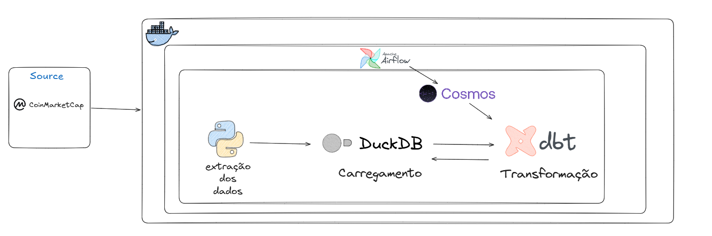
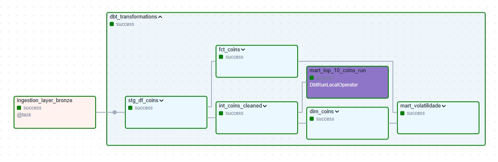
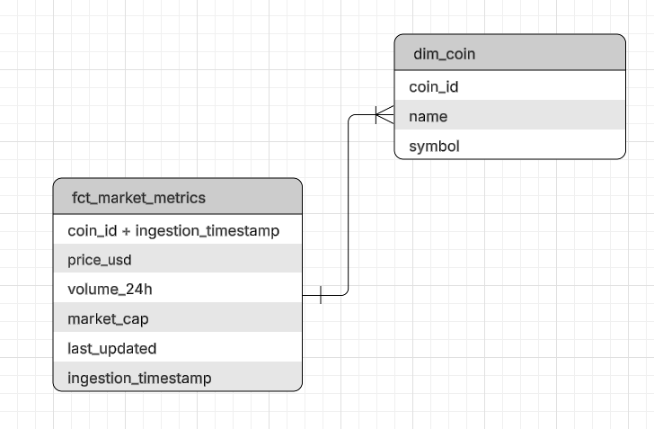

# 🪙 Pipeline Criptomoedas  
**Airflow + dbt + DuckDB (Modern Data Stack)**


Este projeto implementa um pipeline de dados ponta a ponta seguindo a **Arquitetura Medallion**. O objetivo é extrair dados da API do CoinMarketCap, processá-los através de camadas de qualidade e disponibilizar métricas de mercado para análise.

---

## 1. Arquitetura do Projeto

O sistema foi desenhado separando logicamente o **Plano de Controle** (quem orquestra) do **Plano de Dados** (onde o dado é armazenado e processado), garantindo escalabilidade e resiliência.



###  A Escolha do Astronomer Cosmos (Integração Airflow + dbt)
Em arquiteturas tradicionais, a execução do dbt pelo Airflow é feita através de um único `BashOperator`. Essa abordagem cria dois grandes problemas: 
1. **Manutenção Manual:** Engenheiros precisam espelhar manualmente as dependências do dbt nas DAGs do Airflow.
2. **Efeito "Caixa Preta":** Se um modelo no meio da esteira falhar, o Airflow mostra falha na tarefa inteira, dificultando o debug.

Para resolver isso, implementamos a biblioteca **Astronomer Cosmos**. O Cosmos lê dinamicamente o `manifest.json` do dbt em tempo de execução e traduz cada modelo e teste SQL em uma tarefa nativa do Airflow. Isso elimina o trabalho manual e traz **observabilidade granular**, permitindo retentativas isoladas apenas no modelo que falhou.

---

##  2. Linhagem e Orquestração

A extração opera em lotes (*batch*) e o pipeline foi projetado para ser estritamente **idempotente** — ou seja, pode ser executado múltiplas vezes sem risco de duplicar os dados no Data Warehouse. 

Abaixo, a visualização da DAG orquestrando as tarefas de extração (via Python) e as tarefas granulares de transformação (via Cosmos/dbt):



### Fluxo de Camadas (Medallion) no DuckDB:
* **Bronze (Raw):** Dados extraídos da API em JSON e convertidos para o formato colunar `.parquet`.
* **Silver (Staging/Intermediate):** Etapa de higienização, com padronização de tipos, renomeação de colunas e tratamento de valores nulos.
* **Gold (Marts):** Camada final voltada ao negócio para geração de insights (ex: volatilidade e ranking).

---

##  3. Modelagem Dimensional (Camada Gold)

Para garantir a performance analítica e facilitar o entendimento do negócio, os dados na camada Gold foram estruturados seguindo os princípios do **Star Schema** de Kimball.



* **Dimensão (A Entidade - `dim_coin`):** Armazena os atributos descritivos e estáticos de cada criptomoeda (nome e símbolo).
* **Fato (O Evento - `fct_market_metrics`):** Registra as variações de mercado. A granularidade é definida pela combinação da moeda com o momento exato da extração, permitindo análises precisas de séries temporais (Time Series).

*(Nota: Na implementação física, o modelo utiliza Surrogate Keys geradas via hash no dbt para garantir a integridade referencial).*

---

## 🚀 Guia de Instalação e Execução

### 1. Pré-requisitos
* Docker Desktop instalado
* Astro CLI instalado no seu ambiente Linux/WSL
* DBeaver instalado para consulta de dados

### 2. Clonagem do repositorio
```bash
git clone https://github.com/kaiquehsp/pipeline_criptomoedas.git
cd pipeline_criptomoedas

```

### 3. Ajuste Crítico de Permissões (WSL/Docker)
Para evitar o erro PermissionError: [Errno 13], é necessário garantir que o container do Airflow tenha permissão de escrita na pasta de dados:
```
bash
mkdir -p include/01-bronze-raw
sudo chmod -R 777 include/
```


## 4. Configuração de Variáveis de Ambiente

Crie um arquivo `.env` na raiz do projeto:
```
env
COINMARKETCAP_API_KEY=sua_chave_aqui
BRONZE_DATA_DIR=/usr/local/airflow/include/01-bronze-raw
```
     Para gerar sua api_key, acesse o site https://coinmarketcap.com/api/

## 5. Inicialização do Projeto

```bash
# Inicializa as configurações locais do Astro CLI
astro dev init

# Constrói a imagem e sobe a infraestrutura do Airflow
astro dev start      #aperte 'y' para prosseguir com a inicialização

Nota: O repositório já contém um arquivo .airflowignore configurado para ocultar as DAGs de exemplo geradas automaticamente pelo comando init.
```

**Acesse a UI do Airflow em:**
👉 `http://pipeline-criptomoedas.localhost:6563`

**Login:** `admin / admin`

**Dispare a DAG:** `crypto_medallion_pipeline`


## 6. Transformação com dbt (Camadas Medallion)

No fluxo normal do pipeline, **o Airflow (via Cosmos) aciona o dbt automaticamente**. O dbt atua diretamente dentro do **DuckDB**, organizando os dados na seguinte estrutura:

### Camadas de Dados

- **Bronze (Raw):** Dados brutos extraídos da API, armazenados em formato **Parquet** sem tratamento.
- **Silver (Staging & Intermediate):** Etapa de higienização e padronização:
  - Ajuste de tipos de dados.
  - Renomeação de colunas.
  - Tratamento de valores nulos.
- **Gold (Marts):** Camada final voltada ao negócio (Modelagem Dimensional):
  - Tabelas de dimensão e fato.
  - Métricas consolidadas.
  - Exemplos: `mart_volatilidade`.

---

###  Desenvolvimento e Execução Manual (Opcional)

Como a orquestração oficial é feita pelo Airflow, você **não precisa** rodar o dbt manualmente para o pipeline funcionar. 

Porém, caso você deseje desenvolver novos modelos, debugar erros ou rodar testes isolados no ambiente local sem precisar disparar a DAG inteira, siga os passos abaixo:

```bash
# 1. Acesse o terminal interativo do container do Astro
astro dev bash

# 2. Ative o ambiente virtual e navegue até a pasta do dbt
source dbt_venv/bin/activate
cd dbt/projeto_engenharia/dbt_code/

# 3. Instale pacotes e execute o projeto apontando para o profile local
dbt deps --profiles-dir .
dbt build --profiles-dir .  # Compila os modelos e executa todos os 24 testes de qualidade

```


## 7. Consulta de Dados com DBeaver

O **DuckDB** possui uma limitação importante: apenas um processo pode escrever no banco de dados por vez. Portanto, se o Airflow estiver em execução, é necessário configurar o DBeaver em modo **somente leitura** para evitar erros de bloqueio (`database is locked`).

### Configuração da Conexão

- **Tipo de banco:** DuckDB  
- **Caminho do arquivo:**  
  Selecione o arquivo `local_database.duckdb`, localizado na pasta `include/` do projeto.

### Configuração do Driver

1. Acesse: `Edit Driver Settings` → `Connection Properties`
2. Adicione o seguinte parâmetro:

| Propriedade        | Valor |
|--------------------|--------|
| `duckdb.read_only` | `true` |

###  Query de Teste

Execute a seguinte consulta para validar a conexão:

```sql
SELECT * FROM main_mart.mart_volatilidade;
```

---


## 📂 Estrutura do Repositório

```text
📦 pipeline_criptomoedas
 ┣ 📂 dags/                       # DAGs do Airflow configuradas via Cosmos
 ┣ 📂 dbt/
 ┃ ┗ 📂 projeto_engenharia/       # Projeto dbt (Modelos SQL, macros, seeds e testes)
 ┣ 📂 img/                        # Diagramas arquiteturais e assets da documentação
 ┣ 📂 include/                    # Scripts Python de extração e Data Lake local (DuckDB/Parquet)
 ┣ 📂 tests/
 ┃ ┗ 📂 dags/                     # Testes unitários para validação de integridade das DAGs
 ┣ 📜 .dockerignore               # Otimização do tamanho da imagem Docker
 ┣ 📜 .gitignore                  # Omissão de arquivos sensíveis (ex: .env) e banco local
 ┣ 📜 Dockerfile                  # Build da imagem customizada do Airflow
 ┣ 📜 airflow_settings.yaml       # Provisionamento de conexões e variáveis do Airflow local
 ┣ 📜 dbt-requirements.txt        # Dependências exclusivas do dbt (ex: dbt-duckdb)
 ┣ 📜 docker-compose.override.yml # Customização de volumes e portas dos containers
 ┣ 📜 packages.txt                # Dependências de sistema (OS/Debian) para o ambiente
 ┣ 📜 requirements.txt            # Pacotes Python do Airflow (ex: astronomer-cosmos, duckdb)
 ┗ 📜 README.md              # Documentação oficial
